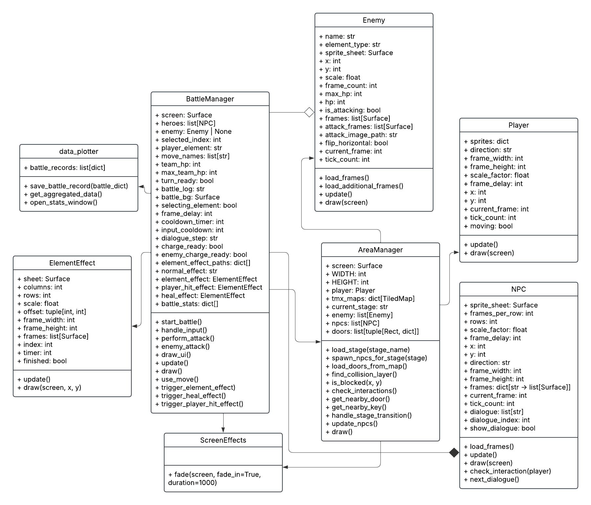

# The Lost Horizons

## Project Overview
Turn based RPG game with animating characters and effects.
The game comes with a story and the map to explore. We will form our team to accompany us in combat as we fought along as the strategist.
Project Review
Studying from “Pokemon” and “Fate grand order” by its fighting system. Each of the different moves will have different effects on players and enemy stats. This project will enhance the project combination of moves that players can choose based on moves type that will affect each status according to characteristics of moves and enemy.

## Game Concept
At first, the player will be the lost adventurer in the circumstances where people from over the world got randomly teleported to the dungeons. In order to survive, he must fight for his life. However, he’s not great at fighting but strategy and planning are his things, he also obtained The analyzer eyes that can detect enemy current status. After walking along somewhere, he found the one who had great talent, yet those individuals only rushed in and fought without plan so he came up with a plan to team up with them and guided us together out of this place. The game will include types of attacks that each will affect player experience which are crucial in the game. Some might drain a lot of the enemy's health but with downside upon the user. Campaign system will challenge players to fight smarter and harder on each level. 

## UML

## Youtube link
https://youtu.be/ZwhswyFPhmQ