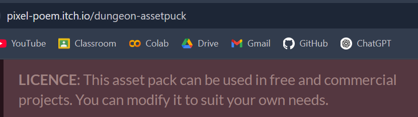
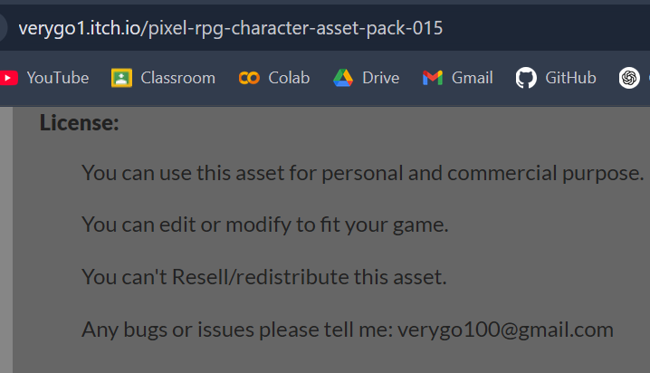
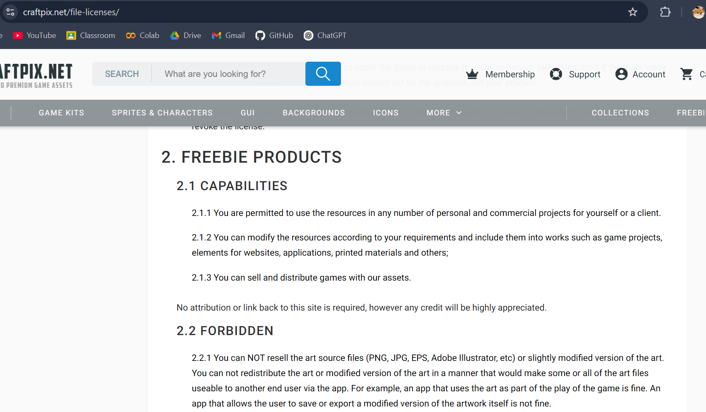
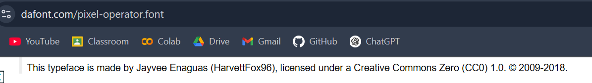
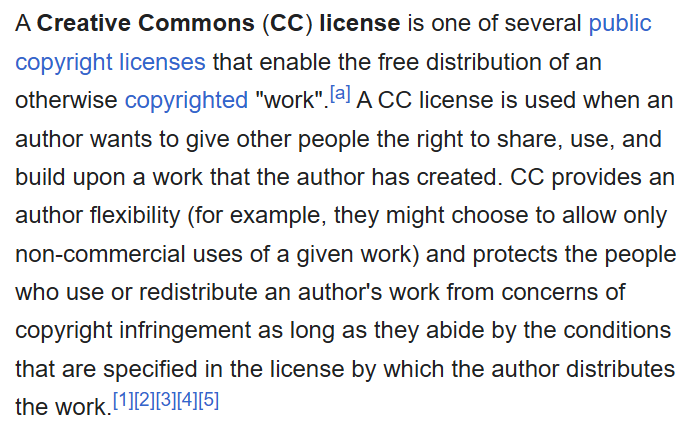
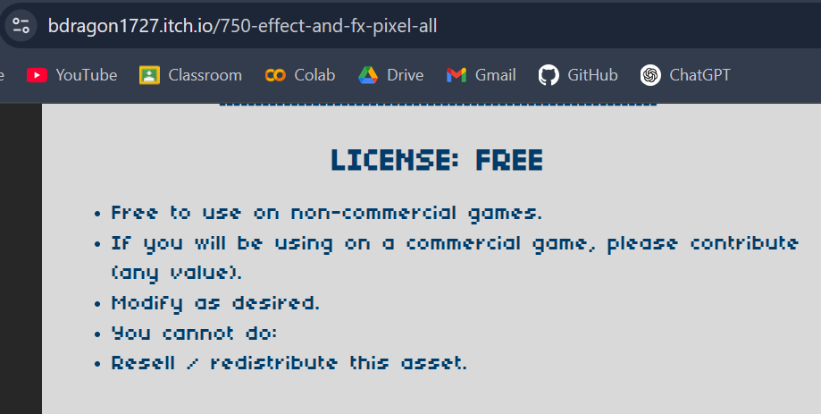

## Sources:
### Tileset for making background in Tiled: https://pixel-poem.itch.io/dungeon-assetpuck

### Allies animation sprite sheets: https://verygo1.itch.io/

### Enemies animation sprite sheets: https://craftpix.net/download/46500/

### Text Fonts: https://www.dafont.com/pixel-operator.font

### Effects animation sprite sheets: https://bdragon1727.itch.io/750-effect-and-fx-pixel-all

## Songs:
### Agreement: https://www.nintendo.co.jp/networkservice_guideline/en/index.html

### Main theme: https://youtu.be/LvytTVeTxCE?si=3U9bFe174En-S6qQ
### Monster theme: https://youtu.be/cMssCMqMHuk?si=3ZDU9sshRXBtx-Cx
### Battle theme: https://youtu.be/FA5DFdBrzJs?si=aEe_FMKNIQyV6EPR
