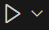

# The Lost Horizons

## Requirements

- Python 3.10 or later
- pygame-ce
- pytmx

---

## Installation Guide

### 1. Install Python
-[Download Python here](https://www.python.org/downloads/)

### 2. Install Game

- pip install pygame-ce
- pip install pytmx


### 3. Run the Game

From the same terminal, path to the game folder:

```bash
cd '.\The Lost Horizons\'
```

 Run by this button


"Arrow up" to walk up  
"Arrow down" to walk down  
"Arrow right" to walk to the right  
"Arrow left" to walk to the left  
"E" to interact  
